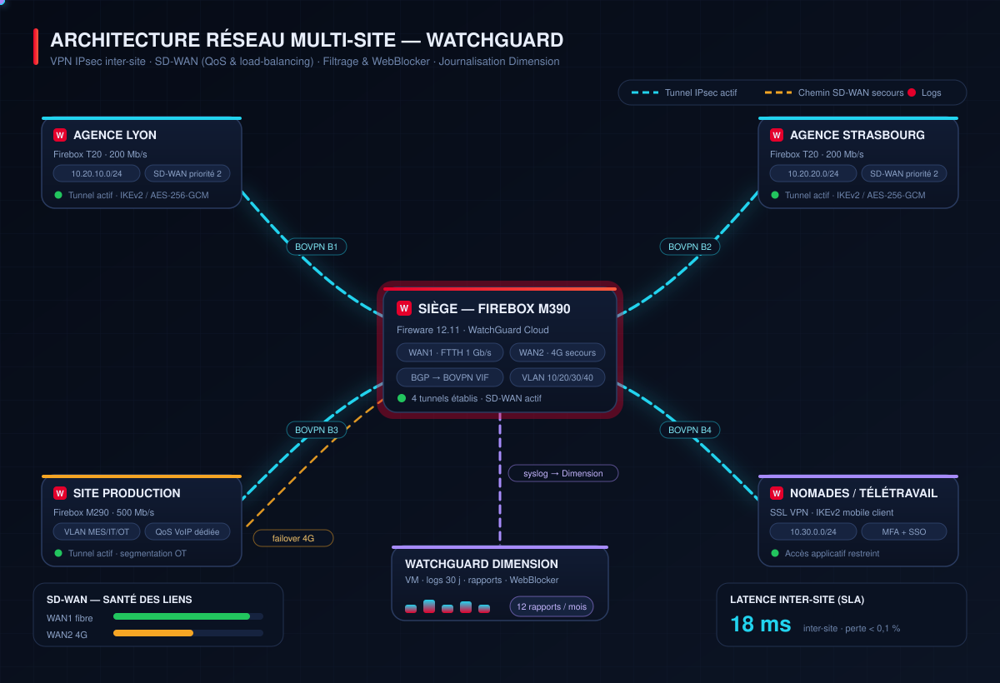
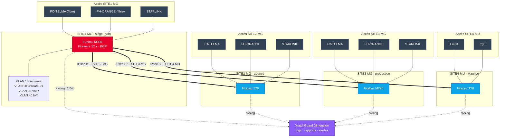
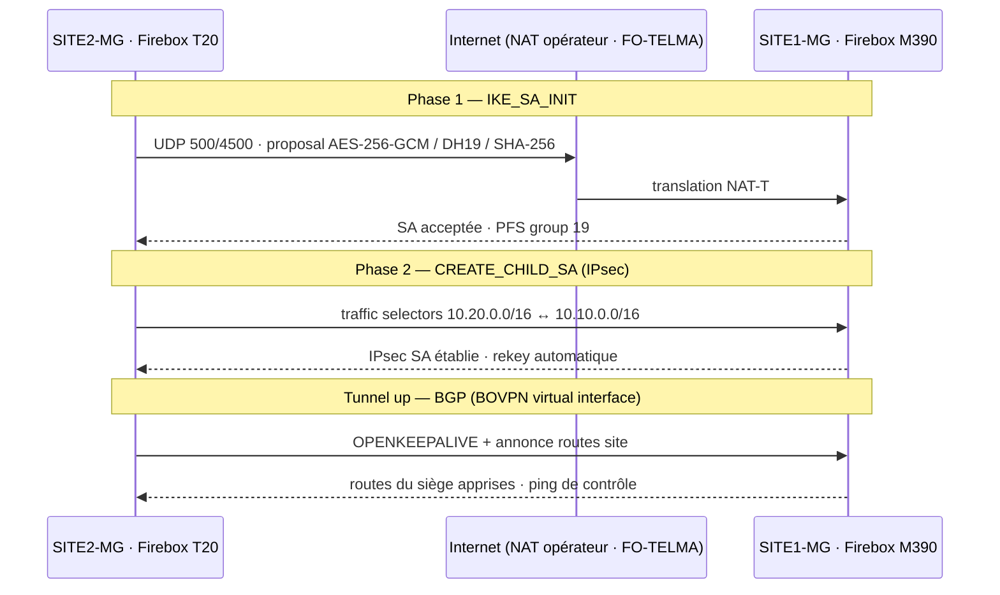
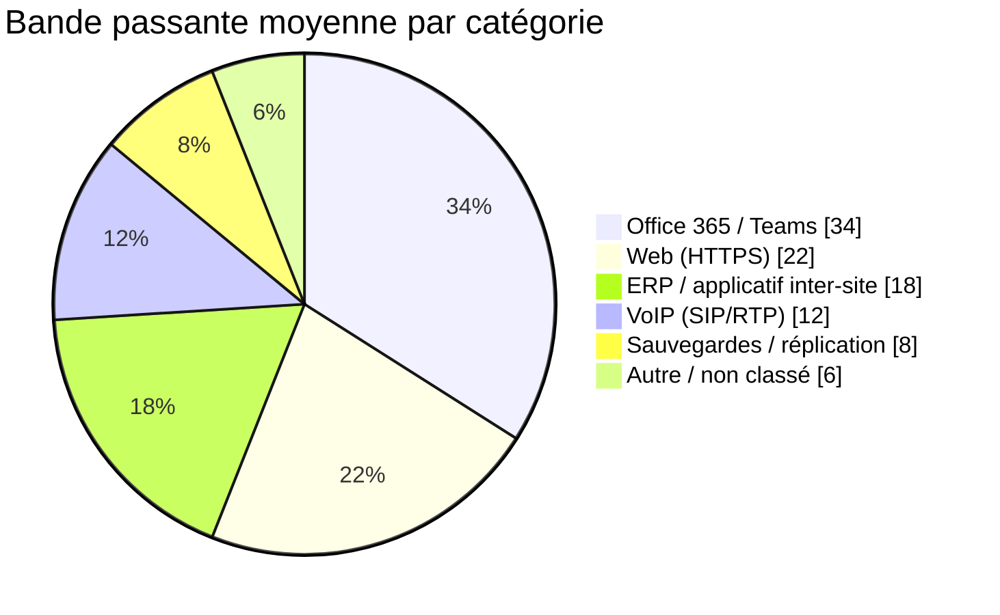
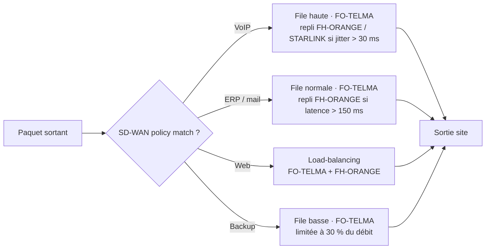
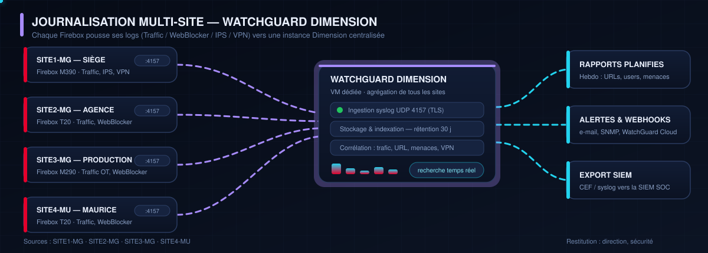
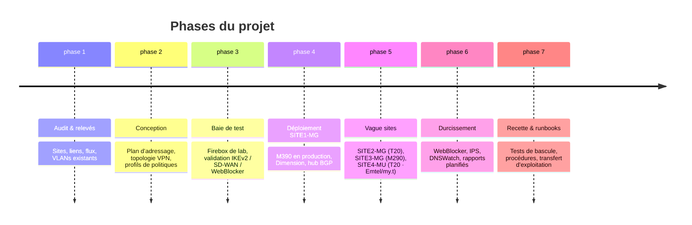

# Réseau multi-site avec WatchGuard

> **Mise en place d'une architecture réseau sécurisée et interconnectée** — VPN IPsec inter-site, SD-WAN multi-FAI, filtrage sortant et journalisation centralisée sur 4 sites (Madagascar & Maurice) équipés de Firebox / Fireware.

[](#aper%C3%A7u)
[](https://www.watchguard.com/help/docs/fireware/12/en-US/)
[](#1--vpn-ipsec-inter-site)
[](#2--sd-wan-qos-load-balancing)
[](#3--r%C3%A8gles-de-filtrage--webblocker)
[](#4--journalisation-dimension)
[](#stack--liens-utiles)



---

## Table des matières

1. [Aperçu](#aperçu)
2. [Objectifs & contraintes](#objectifs--contraintes)
3. [Architecture](#architecture)
4. [Fonctionnalités](#fonctionnalités)
   - [1 · VPN IPsec inter-site](#1--vpn-ipsec-inter-site)
   - [2 · SD-WAN (QoS, load-balancing)](#2--sd-wan-qos-load-balancing)
   - [3 · Règles de filtrage & WebBlocker](#3--règles-de-filtrage--webblocker)
   - [4 · Journalisation Dimension](#4--journalisation-dimension)
5. [Segmentation réseau](#segmentation-réseau)
6. [Résilience & tests de bascule](#résilience--tests-de-bascule)
7. [Méthode de déploiement](#méthode-de-déploiement)
8. [Résultats](#résultats)
9. [Compétences mobilisées](#compétences-mobilisées)
10. [Stack & liens utiles](#stack--liens-utiles)

---

## Aperçu

Parc de **4 sites** — **SITE1-MG**, **SITE2-MG**, **SITE3-MG** (Madagascar) et **SITE4-MU** (Maurice) — interconnectés en **hub-and-spoke** via des tunnels **IPsec BOVPN**, avec :

| Site | Rôle | Firebox | Liens d'accès (FAI) | Sous-réseau |
|------|------|---------|---------------------|-------------|
| **SITE1-MG** | Siège (hub) | **M390** | **FO-TELMA** · **FH-ORANGE** · **STARLINK** | `10.10.0.0/16` |
| **SITE2-MG** | Agence | **T20** | **FO-TELMA** · **FH-ORANGE** · **STARLINK** | `10.20.0.0/16` |
| **SITE3-MG** | Production | **M290** | **FO-TELMA** · **FH-ORANGE** · **STARLINK** | `10.30.0.0/16` |
| **SITE4-MU** | Site Maurice | **T20** | **Emtel** · **my.t** | `10.40.0.0/16` |

| Pilier | Réponse apportée |
|--------|------------------|
| **Connectivité** | Tunnels IPsec chiffrés entre les 4 sites, routage dynamique (BGP) sur interfaces virtuelles |
| **Redondance FAI** | 3 liens par site MG (fibre ×2 + Starlink) et 2 liens à Maurice (Emtel, my.t) |
| **Performance** | SD-WAN : choix de chemin selon latence / jitter / perte, équilibrage de charge et priorisation VoIP |
| **Contrôle** | Politiques de filtrage par flux, WebBlocker (catégories d'URL), Application Control, IPS/GAV |
| **Visibilité** | Tous les Firebox journalisent vers **WatchGuard Dimension** : rapports, alertes, preuves d'audit |

**En une phrase :** un utilisateur de SITE2-MG, SITE3-MG ou SITE4-MU atteint les applications de SITE1-MG *comme s'il y était*, avec un trafic contrôlé, priorisé et intégralement tracé.

---

## Objectifs & contraintes

- **Interconnecter** les sites MG et MU avec du multi-FAI (3 liens à Madagascar, 2 à Maurice) sans MPLS coûteux.
- **Garantir la continuité** des applicatifs critiques (ERP, VoIP, messagerie) en cas de dégradation d'un lien.
- **Contrôler l'accès Internet** de tous les sites depuis un référentiel unique (pas de config locale divergente).
- **Centraliser les logs** pour l'exploitation, la sécurité et les obligations d'audit.
- **Administrer à distance** un maximum de sites (WatchGuard Cloud / WSM), interventions sur site minimales.

---

## Architecture



**Négociation du tunnel (IKEv2 / Phase 1 + Phase 2)** — ce qui se passe réellement à l'établissement d'un BOVPN :



Le même échange concerne **SITE3-MG** (`10.30.0.0/16`) et **SITE4-MU** (`10.40.0.0/16`) — pour ce dernier, la négociation IKEv2 transite par les liens **Emtel / my.t** côté mauricien et **FO-TELMA / STARLINK** côté siège (trajet international, latence plus élevée).

**Répartition du trafic observée** (exemple de reporting Dimension sur 30 jours) :



---

## Fonctionnalités

### 1 · VPN IPsec inter-site

Interconnexion **BOVPN** (*Branch Office VPN*) entre le hub **SITE1-MG** et chaque site (**SITE2-MG**, **SITE3-MG**, **SITE4-MU**), en **mode routeur** avec *BOVPN virtual interfaces* pour supporter le routage dynamique :

| Paramètre | Choix retenu | Pourquoi |
|-----------|--------------|----------|
| Protocole | **IKEv2**, NAT-T (UDP 4500) | Re-négociation rapide, traversée NAT opérateur |
| Cipher | **AES-256-GCM** | Chiffrement + authentification en une passe (performances matérielles) |
| Intégrité | SHA-256 / DH group 19 (ECP-256) | Compromis sécurité / coût CPU Firebox |
| PFS | Activé (DH 19) | Clés de rekey isolées de la SA Phase 1 |
| Liens transport | MG : **FO-TELMA + FH-ORANGE** (actifs) + **STARLINK** (secours) — MU : **Emtel + my.t** | Diversité opérateur, aucune dépendance à un seul FAI |
| Topologie | Hub-and-spoke sur **SITE1-MG**, *virtual interfaces* | Permet BGP, ajout d'un site sans retoucher 4 configurations |
| Routage | **BGP** (ou routes statiques dépendantes de la PBR) | Basculer un site vers Starlink / le FAI de secours avec une métrique dégradée |
| Redondance | 2 tunnels/site + DPD (*Dead Peer Detection*) + keepalive BGP | Détection de coupure < 10 s, bascule automatique |
| Accès nomades | SSL VPN / IKEv2 client sur SITE1-MG | Même référentiel de politiques que les sites |

**Contrôle d'admission** : chaque tunnel n'accepte que les sous-réseaux déclarés dans les *traffic selectors* — un site compromis ne peut pas explorer le reste du parc.

<details>
<summary><b>Extrait de politique Fireware — flux inter-site (BOVPN)</b></summary>

```text
Policy      : SITE1-to-SITES
From        : Any-External / BOVPN-VIF-*   →   To : Site-Networks (10.20 / 10.30 / 10.40.0.0/16)
Action      : Allow
NAT         : Dynamic (IP de l'interface sortante)
Scan        : Gateway AntiVirus ✔  IPS ✔  Application Control ✔
WebBlocker  : hors périmètre (trafic interne)
Timeout     : 3600 s (long-lived sessions ERP)
Logging     : Snmp Trap + Dimension
```

```text
Policy      : SITES-to-SITE1-SRV
From        : 10.20.0.0/16, 10.30.0.0/16, 10.40.0.0/16   →   To : SITE1-Servers (VLAN 10)
Action      : Allow — ports 443, 3389/RDP (jump host), 5432, 445
Refus       : toute autre destination → log + alerte
```

</details>

---

### 2 · SD-WAN (QoS, load-balancing)

Les politiques **SD-WAN** de Fireware décident, *à chaque paquet*, du lien et du tunnel à utiliser, en se basant sur la santé mesurée en continu (latence, jitter, perte de paquets) :

| Priorité | Trafic | Chemin principal | Chemin de secours | Déclencheur de bascule |
|----------|--------|------------------|-------------------|------------------------|
| 1 | VoIP / Teams (UDP audio) | **FO-TELMA** (fibre) | **FH-ORANGE** → **STARLINK** | perte > 1 % **ou** jitter > 30 ms |
| 2 | ERP, messagerie | **FO-TELMA** | **FH-ORANGE** → **STARLINK** | latence > 150 ms pendant 5 s |
| 3 | Web / HTTPS | Load-balancing FO-TELMA + FH-ORANGE | STARLINK en complément | lien dégradé (réservation satellite) |
| 4 | Sauvegardes, mises à jour | **FO-TELMA** (fenêtre horaire) | — | — |

> **SITE4-MU** dispose de 2 liens seulement : **Emtel** en principal, **my.t** en secours — mêmes règles de priorité, seuils adaptés à la latence internationale.

- **Load-balancing** : répartition *round-robin* pondérée entre FO-TELMA et FH-ORANGE sur le trafic non critique (Starlink gardé pour le repli).
- **QoS sortant** : files de priorité *high / normal / low* — la VoIP passe toujours en premier, les sauvegardes sont limitées en débit pour ne jamais saturer le lien.
- **Multi-FAI** : chaque site MG embarque **3 liens** (2 fibres + satellite) et chaque site MU **2 liens** — un FAI peut tomber sans impact métier.
- **Visibilité** : dans WatchGuard Cloud, latence/jitter/perte **par site et par FAI**, avec historique — ce qui alimente les décisions de renouvellement d'offre opérateur.



---

### 3 · Règles de filtrage & WebBlocker

Un **référentiel unique** de politiques, poussé à tous les sites (WatchGuard Cloud / Policy Manager), en lecture « *défaut refus, autorisation explicite* » :

| Couche | Outil WatchGuard | Rôle |
|--------|------------------|------|
| L3/L4 | **Firewall policies** | Flux source/destination/port, zones (External, Internal, BOVPN, Wi-Fi) |
| L7 apps | **Application Control** | Bloque ou limite par application (torrent, streaming non autorisé, VPN non approuvés) |
| URL | **WebBlocker** | Catégories d'URL (malware, phishing, réseaux sociaux, jeux, adultes), liste personnalisée, *allow/deny by category* |
| DNS | **DNSWatch** | Réécriture des réponses DNS vers des nages propres, blocage des domaines malveillants |
| Menaces | **IPS + Gateway AntiVirus + APT Blocker** | Inspection des flux autorisés (SSL décrypté sur flux sortant autorisées) |
| Wi-Fi | **SSID invités isolés** | Captive portal, séparation du VLAN visiteurs |

**Exemple de profil WebBlocker « Corp-Standard »** poussé sur tous les sites :

| Catégorie | Décision | Commentaire |
|-----------|----------|-------------|
| Malware / Phishing / Command & control | **Deny (non modifiable)** | Protection impérative |
| Logiciels piratés, dropped domains | **Deny** | |
| Réseaux sociaux | **Deny en horaire ouvré** / allow le soir | Gain de productivité, sans frustration subie |
| Streaming vidéo | **Limité à 1,5 Mb/s** | La bande passante reste disponible pour l'activité |
| Cloud personnel (storage) | **Deny** | Exfiltration de données maîtrisée |
| Recherche, SaaS métier, presse | **Allow** | |

Chaque refus est **loggé** (utilisateur, FQDN, catégorie, site) → visible dans Dimension et exploitable en alerte.

<details>
<summary><b>Ordre de traitement appliqué sur un flux sortant</b></summary>

```text
1. Zone source / ACL interne          → refus si non conforme à la segmentation
2. IPS (signatures)                   → drop si match critique
3. Application Control                → allow / limit / drop par app
4. WebBlocker (catégorie d'URL)       → allow / deny selon profil utilisateur
5. Politique de pare-feu (dst, port)  → allow seulement si règle explicite
6. Entraînement vers Dimension        → log systématique du verdict
```

</details>

---

### 4 · Journalisation Dimension

**WatchGuard Dimension** (VM centralisée) consolide les logs de **tous** les Firebox — plus aucune donnée ne reste enfermée dans un site.



| Élément | Détail |
|---------|--------|
| Collecte | Syslog **UDP 4157** (chiffré en TLS quand le trajet sort du LAN) |
| Sources | Traffic, WebBlocker, IPS/GAV, VPN (connexions et raisons de refus), DHCP, événements matériel |
| Rétention | 30 jours en ligne (au-delà : export/archivage externe) |
| Restitution | Tableaux de bord temps réel, **rapports PDF planifiés** (hebdo/mensuel), recherche plein texte |
| Alertes | E-mail, SNMP trap, webhook → WatchGuard Cloud / outil d'exploitation |
| Interop | Export **CEF / syslog** vers une SIEM externe pour corrélation SOC |
| Conformité | Rapports d'activité requis pour les audits (habilitation, traçabilité des accès) |

**Rapports exploités au quotidien**

1. **Top destinations / utilisateurs** — détecter un poste qui exfiltre, un flux anormal la nuit.
2. **WebBlocker — refus par catégorie** — piloter le réglage des politiques (et la formation des équipes).
3. **Menaces bloquées** — volume, origine, évolution après chaque campagne de phishing.
4. **Disponibilité des tunnels / liens** — prouver le respect du SLA et justifier les bascules de FAI (FO-TELMA → FH-ORANGE → STARLINK / Emtel → my.t).
5. **Connexions VPN nomades** — qui s'est connecté, d'où, quand (obligation d'audit).

---

## Segmentation réseau

| VLAN | Périmètre | Politique dominante |
|------|-----------|---------------------|
| **10** | Serveurs / applications | Accès depuis les sites autorisés uniquement, journaux intensifs |
| **20** | Postes utilisateurs | Sortie Internet contrôlée + accès VLAN 10 (accès journalisé) |
| **30** | VoIP | QoS haute priorité, isolation L2, pas d'accès Internet direct |
| **40** | IoT / imprimantes / MES | Accès sortant minimal, jamais source vers VLAN 10 |
| **50** | Invités (Wi-Fi) | Internet seul, limité en débit, aucune route vers l'interne |

Règle transverse : **un VLAN n'atteint un autre VLAN que par une politique explicite** — la carte des flux est tenue à jour dans la documentation du dépôt.

---

## Résilience & tests de bascule

| Scénario | Comportement observé | Critère de succès |
|----------|----------------------|-------------------|
| Coupure **FO-TELMA** (site MG) | Bascule vers **FH-ORANGE**, puis STARLINK ; BGP ré-annonce avec métrique dégradée | Sessions critiques rétablies < 60 s |
| Coupure **Emtel** (SITE4-MU) | Bascule vers **my.t**, tunnel IPsec réétabli | SITE4-MU joignable < 90 s |
| Mort d'un Firebox (SITE2 / 3 / 4) | DPD détecte, tunnel côté SITE1-MG rejeté, alerte Dimension | Alerte reçue, coupure visible dans les rapports |
| Dégradation latence (SD-WAN) | Bascule VoIP/ERP vers le lien sain | Aucune coupure perceptible en réunion Teams |
| Panne Dimension | Les Firebox continuent de journaliser localement | Pas d'impact sur le trafic, resynchronisation ensuite |

Chaque scénario fait l'objet d'un **test planifié** (créneau de maintenance) et d'une **trace dans Dimension** : on ne prouve pas la résilience, on la mesure.

---

## Méthode de déploiement



**Bonnes pratiques appliquées**

- Configuration **versionnée** (export Policy Manager / sauvegardes `.xml` horodatées) avant toute modification.
- Déploiement **site par site**, en fenêtre de maintenance, avec retour arrière possible.
- Comptes d'administration **personnalisés + MFA**, jamais de compte partagé.
- Mises à jour Fireware planifiées (patch sécurité), testées en lab.
- *Zero-touch* quand c'est possible : mêmes profils, mêmes noms de politiques sur tous les sites.

---

## Résultats

<!-- Ajuste les chiffres ci-dessous à ta propre expérience -->
| Indicateur | Avant | Après |
|------------|-------|-------|
| Inter-sites | MPLS partiel, 1 lien unique par site | 4 sites en IPsec + 3 FAI/site MG, 2 FAI/site MU |
| Temps d'établissement d'un nouveau site | Provisionnement opérateur (semaines) | Firebox livrée + tunnel configuré en **< 1 j** |
| Contrôle Internet | Politiques locales divergentes | Référentiel **unique**, poussé à tous les sites |
| Visibilité | Logs sur chaque boîte, consultation rare | Dimension centralisée : rapports hebdo + alertes |
| Continuité VoIP | 1 seul lien par site, coupures perçues | Bascule SD-WAN transparente (FO-TELMA → FH-ORANGE → STARLINK) |
| Audit | Captures d'écran manuelles | Rapports Dimension exportables, rétention 30 j |

---

## Compétences mobilisées


---

## Stack & liens utiles

| Rôle | Solution |
|------|----------|
| Pare-feu / routeur | WatchGuard Firebox **M390** (SITE1-MG), **T20** (SITE2-MG, SITE4-MU), **M290** (SITE3-MG) |
| Accès WAN | **FO-TELMA** + **FH-ORANGE** + **STARLINK** (sites MG) · **Emtel** + **my.t** (SITE4-MU) |
| OS | **Fireware 12.x** |
| Interconnexion | IPsec **BOVPN** hub-and-spoke sur SITE1-MG (virtual interfaces) + BGP |
| SD-WAN | Politiques SD-WAN Fireware + Multilink multi-FAI |
| Filtrage | WebBlocker, DNSWatch, Application Control, IPS, Gateway AntiVirus, APT Blocker |
| Gestion & logs | **WatchGuard Cloud** / WSM Policy Manager + **WatchGuard Dimension** |
| Nomades | SSL VPN / client IKEv2, MFA |

- Documentation officielle : <https://www.watchguard.com/help/docs/fireware/12/en-US/>
- Centre de connaissances : <https://www.watchguard.com/support>
- Dimension : <https://www.watchguard.com/wgrd-products/dimension>

---

*Projet réalisé dans le cadre de la constitution d'un portfolio infrastructure & sécurité réseau — architecture, mise en place, durcissement et exploitation d'un parc multi-site WatchGuard.*
